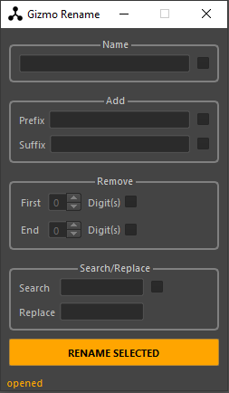

# gizmo
Maya Python tools

I'm a Technical Animator in the games industry and over the years I've acquired a lot of personal code from numerous
passion projects. I've decided to sort through my old work and create a suite of tools for my personal use. I'm
hosting it on GitHub so other people can use my tools too, I enjoy tool development so if you do use my tools then 
please leave feedback.

Download the repository and add it to the scripts folder for your maya version, you can launch from command line or 
create a shelf for future use.

```
import gizmo

# Launch rename tool
gizmo.rename.launch()

# or

# Create shelf
gizmo.create_shelf()
```
 [Watch the Video](media/rename.webm)