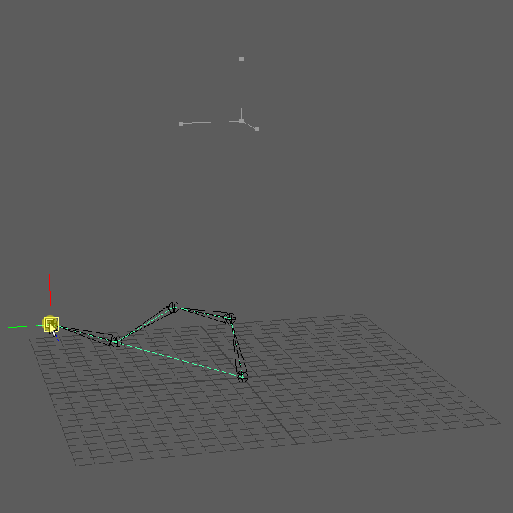
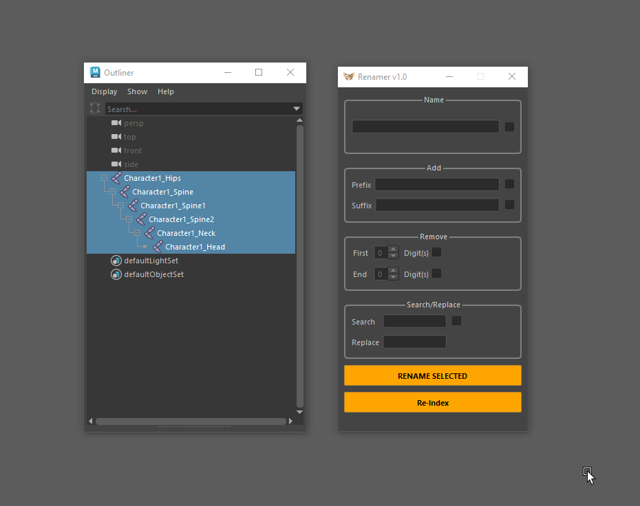
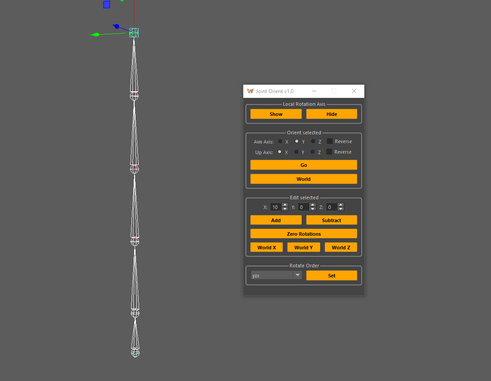
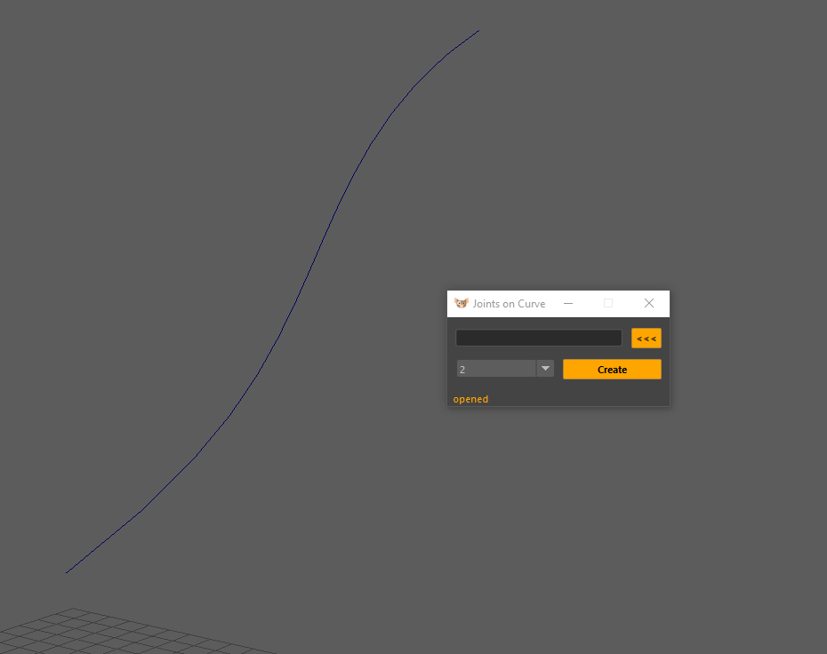

# gizmo
Maya Python tools

I'm a Technical Animator in the games industry and over the years I've acquired a lot of personal code from numerous
passion projects. I've decided to sort through, organise and make tools available to everyone.

if you do use my tools then please leave feedback!

### Node Editor
Pure Python Node Editor created with Pyside2.

  

### Maya API Plugin: FABRIK
An IK solver plugin for Maya using OpenMaya, based of this paper:
http://www.andreasaristidou.com/publications/papers/FABRIK.pdf

  

### Renamer
A tool for renaming objects in Maya, inspired by the useful rename tool in 3DS Max.

  

### Joint Orient
Utility tool for updating joint orientations.

  

### Joints on Curve
Utility tool for placing joint along nurbs curve.

  

